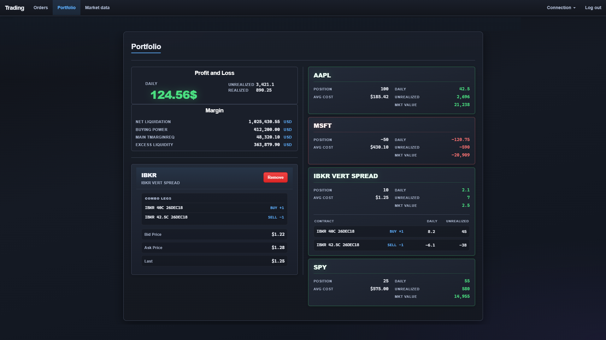
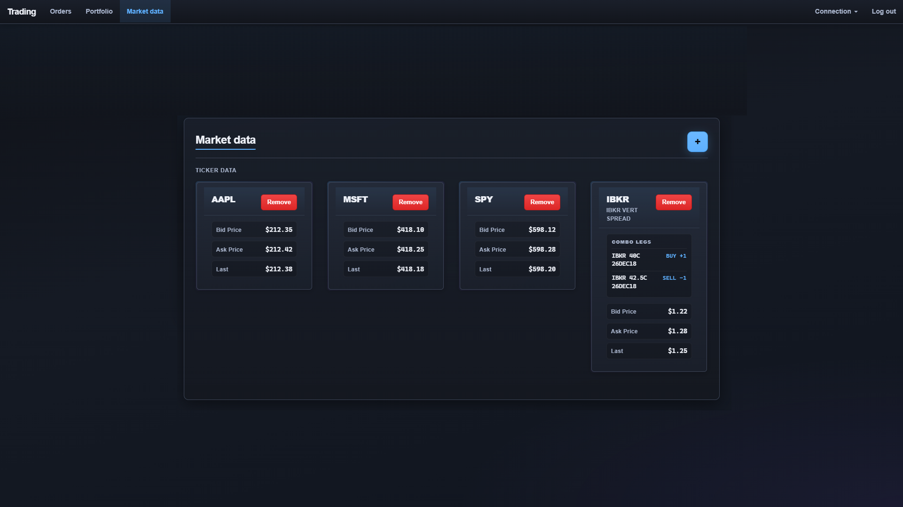

# springboot-trading

Spring Boot stack for trading automation: **IBKR** integration, optional **Kafka**, and an **Angular** UI.

## Screenshots

Angular UI with a live API and data, or **static demo data** for screenshots: from [springboot-trading-frontend](springboot-trading-frontend/), run `npm run start:screenshot-mocks` (see script in [package.json](springboot-trading-frontend/package.json); details in [springboot-trading-frontend/README.md](springboot-trading-frontend/README.md)).

### Orders

Compose and submit orders, combo legs, and open market data for the contract.


### Portfolio

Account summary, positions, P&L, and per-contract drill-down.



### Market data

Streaming-style ticker cards (bid / ask / last) per subscribed contract.



---

## Overview

- **Backend:** Maven multi-module project; the runnable app is [`springboot-trading-web`](springboot-trading-web/).
- **Frontend:** [`springboot-trading-frontend`](springboot-trading-frontend/) (Angular). More detail: [springboot-trading-frontend/README.md](springboot-trading-frontend/README.md).
- **Scripts:** [run-all.bat](run-all.bat) / [run-all.ps1](run-all.ps1) start the API and UI from the repo root.

---

## Run everything (recommended)

From the **repository root**, the scripts start the **Spring Boot API** and **Angular dev server** in separate windows. You still need **PostgreSQL** and the IB JAR described below.

### Prerequisites

1. **JDK 17** and **Maven** — use the wrapper: [mvnw.cmd](mvnw.cmd) (Windows) or [mvnw](mvnw) (Unix).
2. **IB TWS API JAR** — copy `TwsApi.jar` from the [IB TWS API (Java)](https://interactivebrokers.github.io/) install into [`lib/tws-api.jar`](lib/tws-api.jar). See [lib/README.txt](lib/README.txt). Maven does not download this from Central; the build expects the file to exist.
3. **PostgreSQL** — database `trading_db_dev`, user `postgres` (see [springboot-trading-web/src/main/resources/application.yml](springboot-trading-web/src/main/resources/application.yml)). The app creates JPA schema `trading` on first pool connections (`CREATE SCHEMA IF NOT EXISTS trading`).
4. **Node.js** / **npm** — for the Angular app under [springboot-trading-frontend](springboot-trading-frontend/).
5. **`POSTGRES_PW`** — must match the Postgres password for user `postgres` (read by the app from the environment).

### `run-all` modes

| Command | What it does |
|--------|----------------|
| [run-all.bat](run-all.bat) or `run-all.bat local` (default) | Sets `SPRING_PROFILES_ACTIVE=local`: no Kafka broker or TWS required at startup; good for UI + API against Postgres only. |
| `run-all.bat full` | Runs `docker compose up -d` using [docker-compose.yml](docker-compose.yml) (Kafka on `127.0.0.1:9092`), waits briefly, then starts the API **without** the `local` profile so Kafka consumers run. Requires **Docker**. |

The script sets default `AUTOTRADE_*` values if they are unset. It runs `npm install` in [springboot-trading-frontend](springboot-trading-frontend/) when `node_modules` is missing.

### Windows — Command Prompt (CMD)

```bat
cd D:\path\to\springboot-trading
set POSTGRES_PW=yourpassword
run-all.bat
```

Full stack with Kafka:

```bat
set POSTGRES_PW=yourpassword
run-all.bat full
```

### Windows — PowerShell

Use `.\` to run a script in the current directory:

```powershell
cd D:\path\to\springboot-trading
$env:POSTGRES_PW = 'yourpassword'
.\run-all.bat
```

Wrapper (forwards arguments to the batch file):

```powershell
$env:POSTGRES_PW = 'yourpassword'
.\run-all.ps1          # same as .\run-all.bat local
.\run-all.ps1 full     # Kafka + default Spring profile
```

### After it starts

| Service | URL |
|--------|-----|
| API | [http://localhost:8080/](http://localhost:8080/) |
| UI | [http://localhost:4200/](http://localhost:4200/) |

Close the **springboot-trading API** and **springboot-trading UI** terminal windows to stop those processes. If you used **`full`**, stop Kafka when finished:

```bat
docker compose down
```

**Not started by `run-all`:** PostgreSQL itself, and **TWS / IB Gateway** (needed for live IB connectivity on the default API port in [application.yml](springboot-trading-web/src/main/resources/application.yml)).

---

## Run manually (without `run-all`)

### Backend only (easiest dev stack — no Kafka / no TWS)

From the repo root:

```powershell
$env:POSTGRES_PW = "<your password>"
$env:AUTOTRADE_DELTA_VALUE = "0.3"
$env:AUTOTRADE_ORDER_LIMIT_VALUE = "1000"
$env:AUTOTRADE_SPREAD_SIZE = "2"
$env:AUTOTRADE_QUANTITY_OF_STRATEGIES = "1"
$env:SPRING_PROFILES_ACTIVE = "local"
.\mvnw.cmd spring-boot:run
```

The root [pom.xml](pom.xml) skips `spring-boot:run` on the aggregator and library modules; only **springboot-trading-web** runs. If module resolution fails:

```powershell
.\mvnw.cmd -pl springboot-trading-web -am spring-boot:run
```

### Frontend only

```powershell
cd springboot-trading-frontend
npm install
npm start
```

Then open [http://localhost:4200/](http://localhost:4200/) (API base URL comes from [springboot-trading-frontend/src/environments/environment.ts](springboot-trading-frontend/src/environments/environment.ts), default [http://localhost:8080/](http://localhost:8080/)).

### Full stack (default Spring profile)

Start Kafka on `127.0.0.1:9092` (e.g. `docker compose up -d` with [docker-compose.yml](docker-compose.yml)), run TWS/Gateway with API on port **7497** as in [application.yml](springboot-trading-web/src/main/resources/application.yml), and **do not** set `SPRING_PROFILES_ACTIVE` to `local`.

---

## See also

- [springboot-trading-frontend/README.md](springboot-trading-frontend/README.md) — Angular CLI, builds, **screenshot mock** mode, and UI-focused notes.
