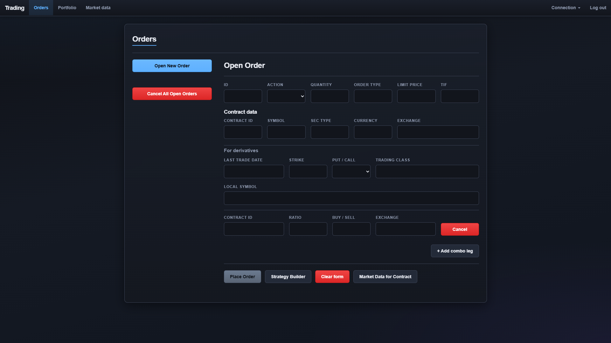

# SpringbootTradingFrontend

This project was generated with [Angular CLI](https://github.com/angular/angular-cli) version 17.0.5.

## Run with the full stack (API + UI)

From the **repository root** (parent folder), use **`run-all.bat`** / **`run-all.ps1`** so the Spring Boot backend and this Angular app start together. See the main **[README.md](../README.md)** section **“Run everything (recommended)”** for prerequisites, PowerShell vs CMD, **`local`** vs **`full`** modes, and URLs.

## Screenshots

### Orders

The **Orders** screen is where you define contracts, order side and size, order type and time-in-force, and optional **combo legs** for multi-leg instruments. From the action row you can **place** or **update** an order, switch between **standard** and **strategy builder** flows when not editing an existing order, **clear** the form, or open **market data** for the current contract.

## Development server

Run `ng serve` for a dev server. Navigate to `http://localhost:4200/`. The application will automatically reload if you change any of the source files.

## Code scaffolding

Run `ng generate component component-name` to generate a new component. You can also use `ng generate directive|pipe|service|class|guard|interface|enum|module`.

## Build

Run `ng build` to build the project. The build artifacts will be stored in the `dist/` directory.

## Running unit tests

Run `ng test` to execute the unit tests via [Karma](https://karma-runner.github.io).

## Running end-to-end tests

Run `ng e2e` to execute the end-to-end tests via a platform of your choice. To use this command, you need to first add a package that implements end-to-end testing capabilities.

## Further help

To get more help on the Angular CLI use `ng help` or go check out the [Angular CLI Overview and Command Reference](https://angular.io/cli) page.
